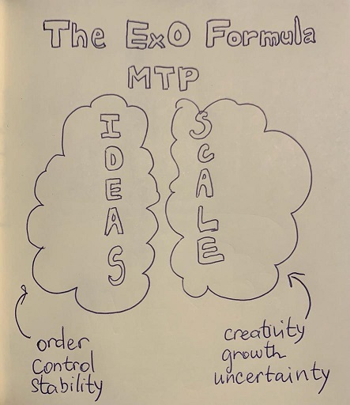

# EXPONENTIAL ORGANIZATION🧑‍💼

by ⭐Aidana Askerbekova⭐

15 March 2022

---

---

---

---

**The Exponential Organization (ExO)**, which is a _purpose-driven entity_ that leverages _new exponential technologies_ and a set of common organizational attributes that allow them to tap into and manage _abundance_ to scale exponentially as technology does.

---

## **Some examples**

---

The ExO framework consists of **the Massive Transformative Purpose (MTP)** as a foundation upon which the remaining 10 attributes stand on.

**IDEAS** a group of five attributes focused on managing abundance to grow:

- Interface
- Dashboards
- Experimentation
- Autonomy
- Social

**SCALE** a group of five attributes focused on connecting and keeping abundance:

- Staff on demand
- Community and crowd
- Algorithms
- Leveraged Assets
- Engagement

---

## **Part 1: MTP Foundation**

### Massive Transformative Purpose

Examples:

- 📺TED: Ideas worth spreading
- 🔎Google: Organize the world's information
- 🚗Uber: Everywhere for everyone

---

## **Part 2: Scale**

- 👩‍💼Staff on demand - minimize full-time staff and outsource tasks.
- 🧑‍🤝‍🧑Community and crowd - build communities and right people will find you and come to you.
- 🧩Algorithms - to leverage data and scale in ways that were not possible even 5 or 10 years ago.
- ⚖️Leveraged Assets - keep critical and outsource everything else.
- 🤝Engagement - enabling collaboration to engineer the results you want.

---

## **Part 3: Ideas**

- 🖊️Interface - customized processes to communicate with customers and other organizations and empower the enterprise's management of its SCALE external attributes.
- 💻Dashboards - a real time and adaptable dashboards with all essential company and employee metrics, accessible to everyone in the organization.
- 🧪Experimentation- the implementation of the lean Startup methodology of testing assumptions and constantly experimenting with controlled risks.
- 🤖Autonomy - self-organizing, multidisciplinary teams operating with decentralized authority.
- 😀Social - allow organizations to manage real-time communication amongst all employees.

---

References:
OpenExo. (September, 2019). ExO attributes: the 11 key elements to build an exponential organization. Retrieved from https://blog.openexo.com/exo-attributes-the-11-key-elements-to-build-an-exponential-organization#:~:text=The%20set%20of%20common%20organizational,%2C%20Dashboards%2C%20Experiments%2C%20Autonomy%20and

Mohout, O., Kiemen, M. (n.d.). A critical perspective to exponential organizations and its hyper scalability. Retrieved from http://mixel.be/files/pdf/Critical-to-exponential_preprint.pdf

Lima, F., Rainatto, G., Andrade, N., Silva, R. (2019). Exponential organizations and digital transformation: two sides of the same coin. International Journal for Innovation Education and Research. 102019, pp. 385-404. Retrieved from https://doi.org/10.31686/ijier.vol7.iss10.1787

Ismalil, S. Eleven secrets you need to know for exponential growth. Retrieved from https://blog.growthinstitute.com/exo/11-attributes
